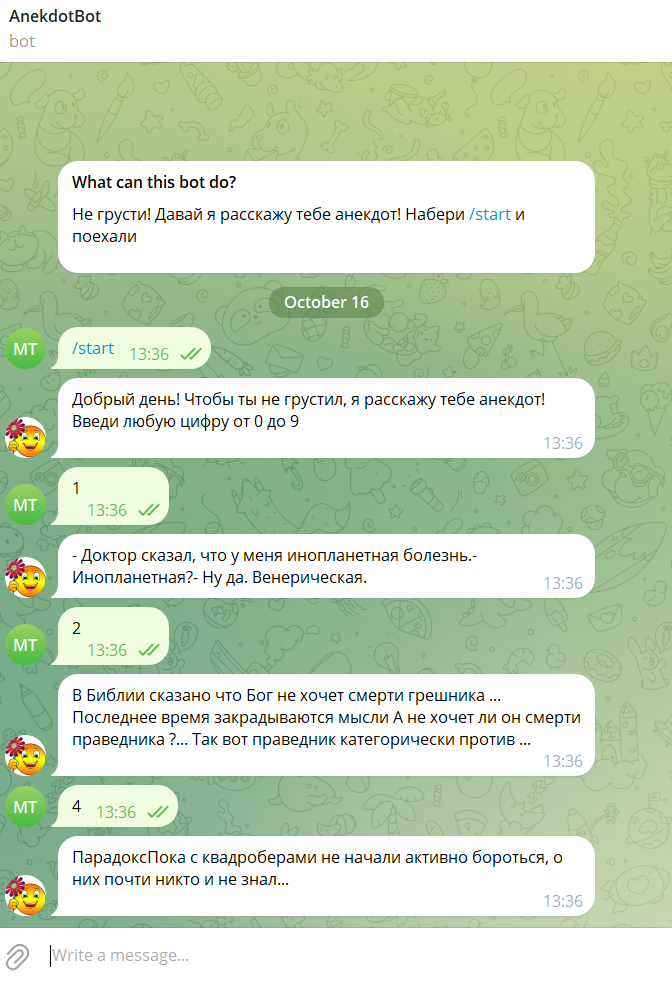

# AnekdotBot 
# телеграм-бот - парсер сайта www.anekdot.ru

Этот бот выдает случайный анекдот с сайта www.anekdot.ru из раздела "Смешные анекдоты за день".

Очень простой бот, выполнен для изучения и отработки навыков парсинга сайтов.

# Используемые библиотеки:
1. requests
2. BeautifulSoup
3. PyTelegramBotAPI
4. random

# Установка и запуск.
Для работы бота необходим установленый python 3.11 или новее. Список используемых библиотек есть в файле requirements.txt. 
Необходимо ввести Токен вашего бота. Бот готов к запуску.